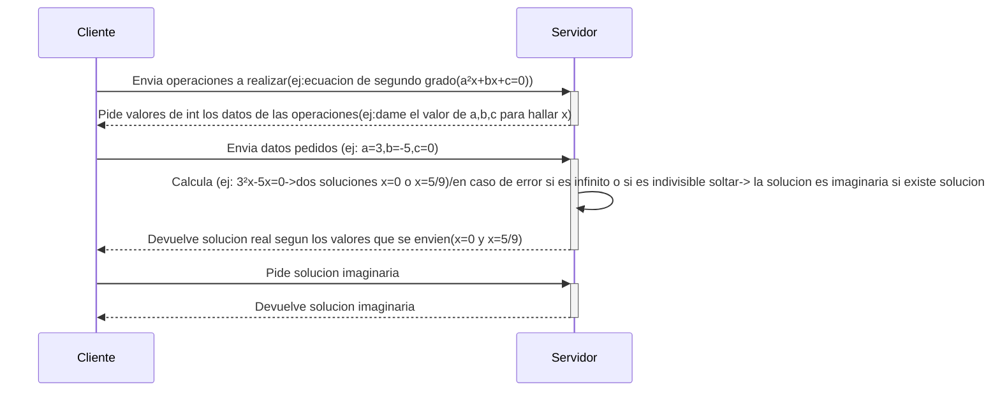

```mermaid
sequenceDiagram
    participant Cliente
    participant Servidor
    Cliente->>+Servidor: Envia operaciones a realizar(ej:ecuacion de segundo grado(a²x+bx+c=0)) 
    Servidor-->>-Cliente: Pide valores de int los datos de las operaciones(ej:dame el valor de a,b,c para hallar x)
    Cliente->>+Servidor: Envia datos pedidos (ej: a=3,b=-5,c=0)
    Servidor->>Servidor: Calcula (ej: 3²x-5x=0->dos soluciones x=0 o x=5/9)/en caso de error si es infinito o si es indivisible soltar-> la solucion es imaginaria si existe solucion
    Servidor-->>-Cliente: Devuelve solucion real segun los valores que se envien(x=0 y x=5/9)
    Cliente->>+Servidor: Pide solucion imaginaria
    Servidor-->>-Cliente: Devuelve solucion imaginaria


```